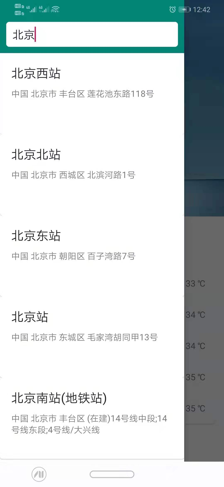
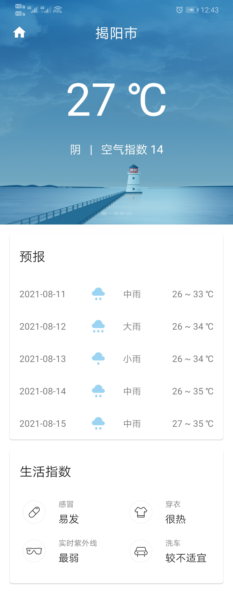

# SunnyWeather
 《第一行代码 Android 第三版》第15章天气项目实践

但有些不一样的地方

## 使用 ViewBinding

本项目并没有引入 `android-kotlin-extensions`，而是按照官方推荐使用 ViewBinding 来绑定视图，相关修改如下：

WeatherActivity.kt

```Kotlin
lateinit var viewBinding: ActivityWeatherBinding

// onCreate
viewBinding = ActivityWeatherBinding.inflate(layoutInflater)
setContentView(viewBinding.root)
```

PlaceFragment.kt

```Kotlin
lateinit var viewBinding: ActivityWeatherBinding

override fun onCreate(savedInstanceState: Bundle?) {
    viewBinding = ActivityWeatherBinding.inflate(layoutInflater)
    setContentView(viewBinding.root)
    // ...
}


override fun onCreateView(
    inflater: LayoutInflater,
    container: ViewGroup?,
    savedInstanceState: Bundle?
): View {
    // 使用 viewBinding 加载布局
    _binding = FragmentPlaceBinding.inflate(inflater, container, false)
    return binding.root
}
```

## WeatherActivity 提供静态方法获得启动 Intent

```Kotlin
companion object {
    fun getStartIntent(context: Context?, lng: String, lat: String, placeName: String) =
        Intent(context, WeatherActivity::class.java).apply {
            putExtra(INTENT_PARAM_LNG, lng)
            putExtra(INTENT_PARAM_LAT, lat)
            putExtra(INTENT_PARAM_PLACE_NAME, placeName)
        }
}
```

在 PlaceAdapter 中

```Kotlin
// onCreateViewHolder
val intent = with(placeList[adapterPosition]) {
    WeatherActivity.getStartIntent(parent.context, location.lng, location.lat, name)
}
fragment.startActivity(intent)
```

## 提供了一个 set 函数用于数据连续赋值

在 PlaceAdapter 中使用

```Kotlin
private fun <A, B> A.set(it: B, block: A.(B) -> Unit) {
    block(it)
}
```

相关使用

```Kotlin
activity.viewModel.set(place.location) {
    locationLng = it.lng
    locationLat = it.lat
    placeName = place.name
}
```

## 使用 onViewCreated 回调

由于 `onActivityCreated()` 已经在高 API 的版本中被弃用，在推荐下使用 `onViewCreated()` 来代替，并初始化相关变量。

该方法在 `onCreateView()` 在执行完成之后调用。

## @SuppressLint("NotifyDataSetChanged")

对于 `notifyDataSetChanged()` 的使用会收到 Android Studio 警告

> If you are writing an adapter it will always be more efficient to use the more specific change events if you can. Rely on notifyDataSetChanged() as a last resort.

因此在 `onViewCreated()` 方法上添加了 **@SuppressLint("NotifyDataSetChanged")** 注解来消除警告

## 截图


